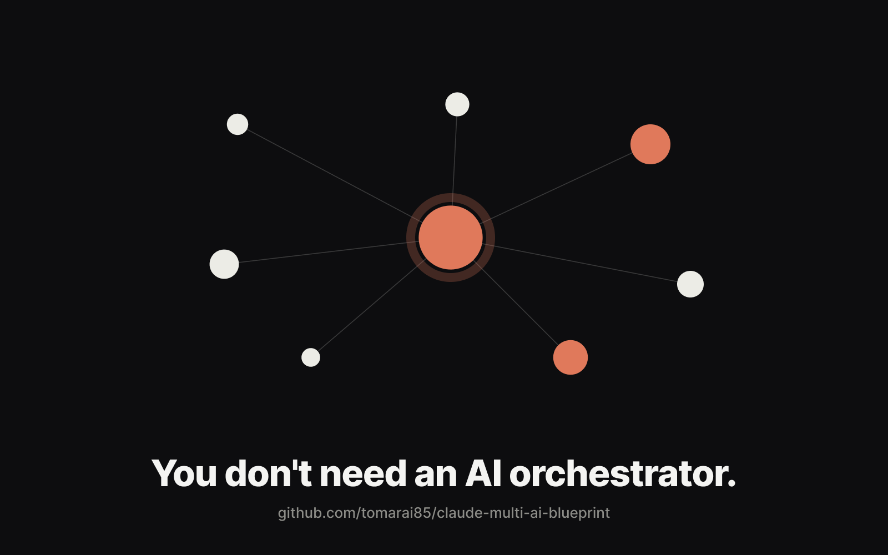
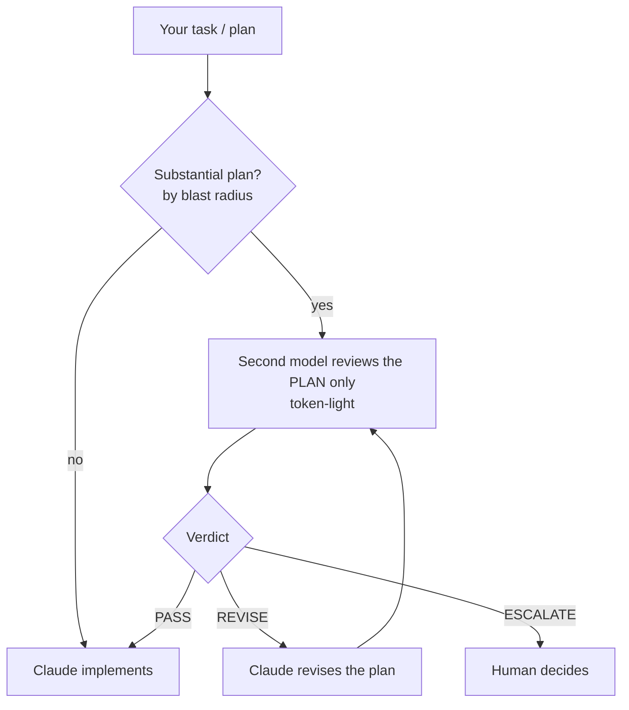

# How to Run Multiple AIs in Claude Code Without Buying an Orchestrator



Everyone is talking about model-orchestration products (Sakana Fugu and friends): one API that routes your task across Claude, GPT, Gemini, etc.

If you already use **Claude Code** (plus any second-model CLI, e.g. Codex or Gemini), you do not need to buy one. Claude Code is the host that runs everything; the second model is a swappable part you call as a reviewer. You can get the useful 80% yourself: cheaper, in your control, with a handful of files. This repo is the exact blueprint plus copy-paste templates.

## TL;DR

1. Do **not** auto-route every task to a second model. That just multiplies tokens.
2. Use a second model (here: Codex / `codex exec`) for **one** high-value job: **reviewing your plan before you build**.
3. Keep it token-light: fire only on *substantial* plans, and feed it the **plan text only** — not your whole codebase.
4. Add a simple **lean / full** toggle for the rare times you do want full multi-model orchestration.

Copy the three files in [`templates/`](templates/) and you have it.

## Why not just buy an orchestrator

If you are a heavy user on flat subscriptions (e.g. Claude Code + a Codex plan), self-hosting is cheaper, because:

- **Flat beats metered.** On a flat plan your marginal token cost is ~0. Usage-based orchestration is billed per token.
- **Orchestration multiplies tokens.** One task fans out to several models + verification + synthesis = 3-5x the tokens of a single call. It buys quality by spending *more*, not less.
- **It is additive, not a replacement.** An orchestration API is a bare endpoint. It cannot be your Claude Code environment (CLI, MCP, local files, your harness). You would pay for it *on top of* what you already have.

The genuinely useful idea inside these products is "let a second model check the work." You can have just that — for the price you are already paying.

## The design (two layers)

```
Layer 1  ROUTING        which model handles a task?      (Opus / Sonnet / Codex)
Layer 2  SECOND-MODEL   what do you use the 2nd model for?
                         ├── REVIEW  = 2nd opinion on YOUR plan   <- the high-value 80%
                         └── EXECUTE = 2nd model writes code       (rarely worth it now)

Modes:   LEAN (default) = review only, token-light
         FULL (opt-in)  = aggressive multi-model, tokens ignored
```

Today the frontier coding models are close enough that "the other model implements better" is rarely true. So the leverage is **review**, not execution.



## The one pattern that matters: Codex reviews your plan

1. **Fire by blast radius, not vibes.** Only run a review when the plan touches: contracts / routing / persistence / auth / infra / agent behavior / external sends / or roughly >150 LOC or >3 files. Skip local, reversible, trivial changes.
2. **Token-light invocation.** Send the **plan text only**, ask for a short answer:
   ```bash
   codex exec --sandbox read-only "Review this PLAN (not the code). Reply terse.
   Verdict must be one of PASS / REVISE / ESCALATE.
   <paste the plan here>"
   ```
3. **Structured verdict closes the loop.** The reviewer returns `PASS` | `REVISE` | `ESCALATE`.
   Before you implement, record one line in your plan: `Reviewer verdict: <X> — <how handled>`.
   No verdict recorded = do not implement. This stops "acknowledge then ignore."

See [`templates/codex-plan-review.md`](templates/codex-plan-review.md) for the full policy.

## Set it up (copy these)

| File | What it is |
|---|---|
| [`templates/CLAUDE.example.md`](templates/CLAUDE.example.md) | A lean project `CLAUDE.md` that tells Claude to run the review on substantial plans |
| [`templates/codex-plan-review.md`](templates/codex-plan-review.md) | The review policy: triggers, the light call, the verdict contract |
| [`templates/routing-mode.sh`](templates/routing-mode.sh) | A 5-line `lean` / `full` toggle |

Steps:
1. Drop `CLAUDE.example.md` content into your project `CLAUDE.md`.
2. Put `codex-plan-review.md` next to it; reference it from `CLAUDE.md`.
3. `chmod +x routing-mode.sh`. Default is lean.
4. Have a second-model CLI installed (`codex` here; any works).

## Cost, honestly

- A single plan review ≈ 15-20k tokens (mostly the reviewer CLI's own startup context), flat-billed, fired only on substantial plans = a few times a day. Negligible.
- The standing cost of this whole setup is a few small markdown files.

## What this is not

Not a product, not a framework, not magic. It is a few files that make a second model check your thinking at the right moments. That is the part of "AI orchestration" actually worth having.
